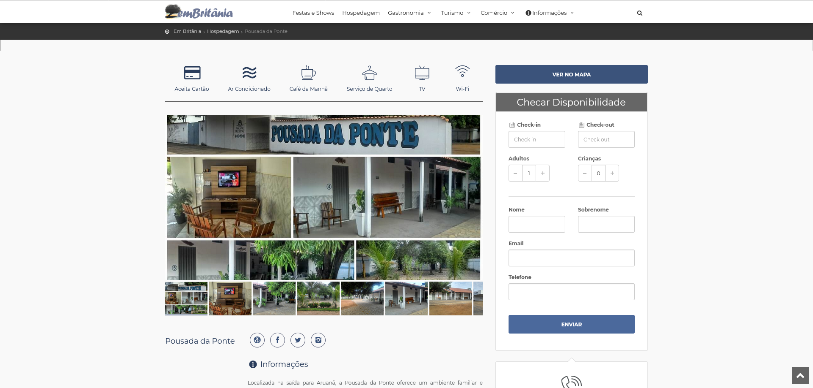

# Portal emBritânia

Este projeto é um portal desenvolvido em **ASP.NET MVC** no ano de 2016, com o objetivo de divulgar o turismo e o comércio local da cidade de Britânia - GO. 

Na época, atuava como empreendedor no ramo de hotelaria e alimentação na cidade e idealizei este portal como uma vitrine digital para valorizar os atrativos turísticos, festas, gastronomia e opções de hospedagem, além de abrir espaço de divulgação para outros estabelecimentos locais.

## Observações

O projeto foi criado como uma iniciativa pessoal para promover o turismo da cidade e incentivar o comércio local.  
Apesar de não estar mais em produção, representa um marco importante no portfólio de desenvolvimento e também como um case de estratégia empresarial.  

O portal serviu como ferramenta de marketing, ampliando a visibilidade do restaurante e hotel, além de fortalecer o ecossistema de comércio local.  

## Funcionalidades

- Página inicial com informações sobre a cidade de Britânia, sua história e principais atrações turísticas.
- Integração com Google Maps para exibição dos pontos turísticos e estabelecimentos.
- Seção dedicada a hospedagens, com hotéis, pousadas, casas para temporada e áreas de camping.
- Página individual de cada hotel com fotos, informações detalhadas, lista de comodidades e formulário de contato para consulta de disponibilidade.
- Estrutura responsiva para acesso em dispositivos móveis e desktops.

## Estrutura do Projeto

- **EmBritania.Dominio/** – Camada de domínio: contém classes de negócio, entidades e lógica central que representam os conceitos-chave da aplicação (turismo, hospedagem, estabelecimento, etc.).
- **EmBritania.Web/** – Camada de apresentação: aplicação ASP.NET MVC, com Views em Razor, controllers e recursos (CSS, JavaScript, imagens), além da integração com APIs como Google Maps.

### Tecnologias e Arquivos Adicionais
- **CSS, JavaScript, HTML e C#** – Linguagens predominantes no projeto, distribuídas entre os arquivos estáticos, scripts client-side, Views e lógica C# do backend.
- **Estrutura MVC clássica** – Controllers, Views (Razor), Models (na camada de domínio) e recursos estáticos devem estar organizados conforme boas práticas ASP.NET MVC, mesmo que os diretórios específicos não estejam visíveis na visão geral.

## Imagens do Projeto

### Página Inicial

### Página de Hospedagem

###  Visualização Histórica

O portal original **embritania.com.br**, que esteve ativo de 2016 a 2022 como vitrine digital de turismo e comércio local, pode ser acessado via página arquivada do Wayback Machine:

- **Arquivo de dezembro de 2016**: [embritania.com.br em 20-dez-2016 (Wayback Machine)](https://web.archive.org/web/20161220124702/http://embritania.com.br/)

Este link permite revisitar o site como ele era em dezembro de 2016, oferecendo um panorama histórico valioso para compreender o layout, conteúdos e funcionamento da época.

---

📌 **Autor:** Rafael Trindade  
📅 **Ano de criação:** 2016  
